CPESR
================
CPESR
2024-10-23

## Données

- <https://www.budget.gouv.fr/documentation/documents-budgetaires/exercice-2025/le-projet-de-loi-de-finances-et-les-documents-annexes-pour-2025/jaunes-budgetaires-2025-plf-2025>

<!-- -->

    ## [1] "Opérateur" "Statut"    "Année"     "Valeur"

## Explorations

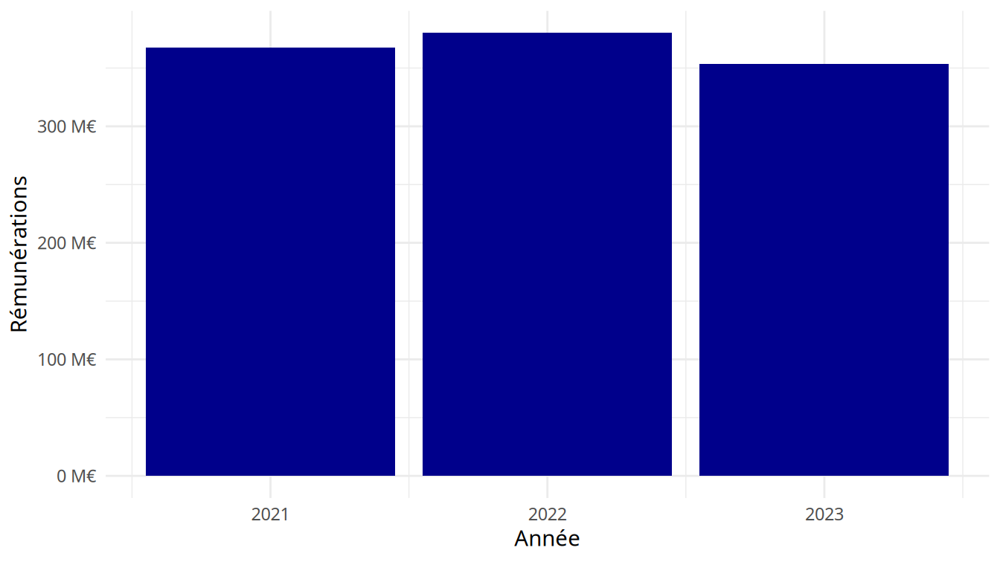

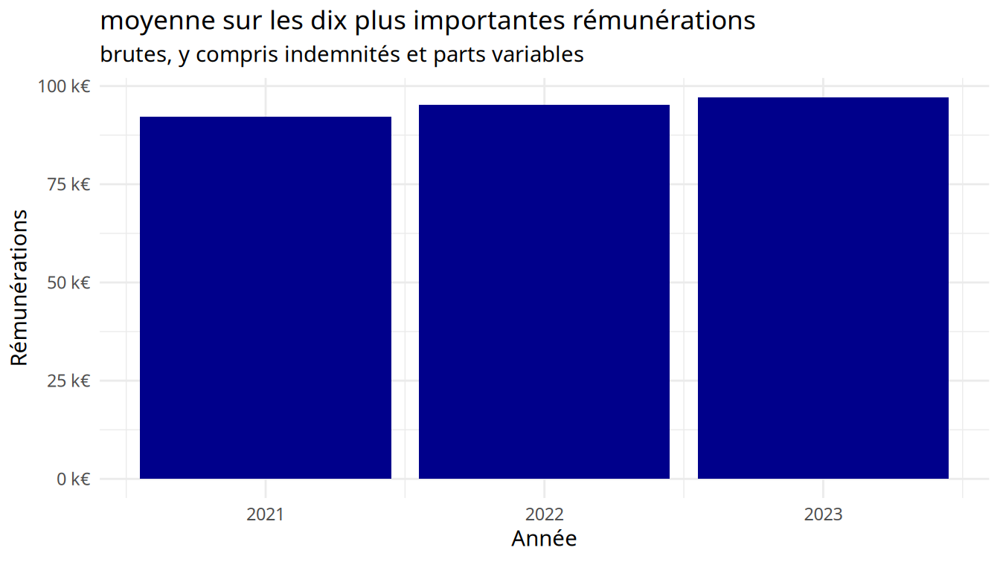

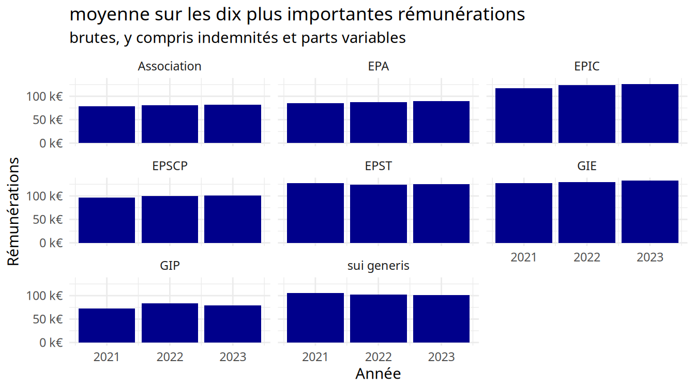

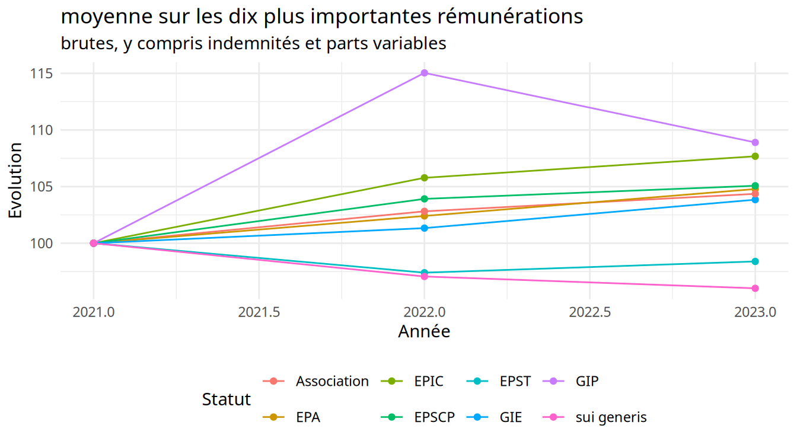

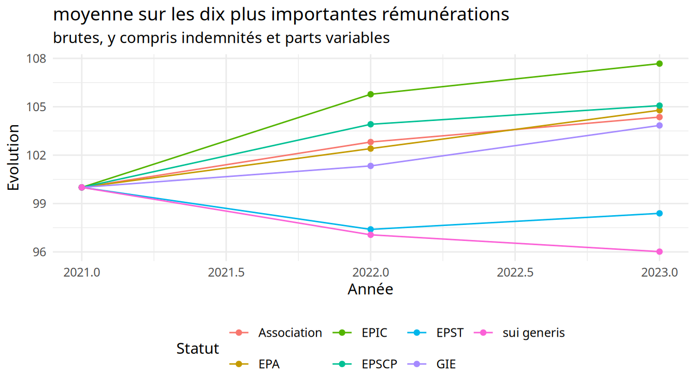

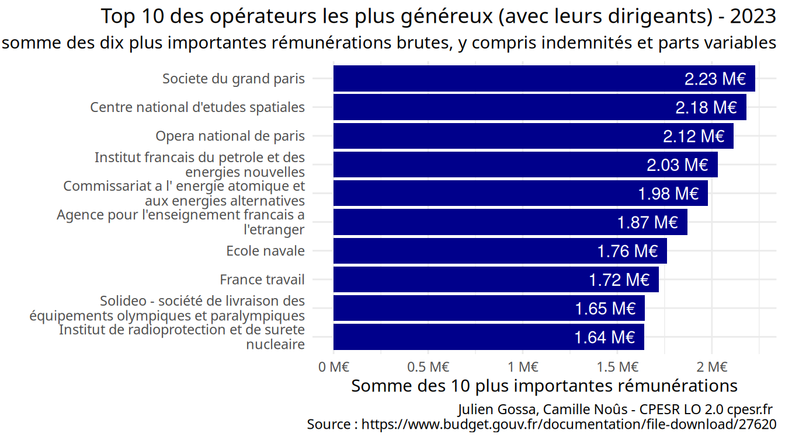

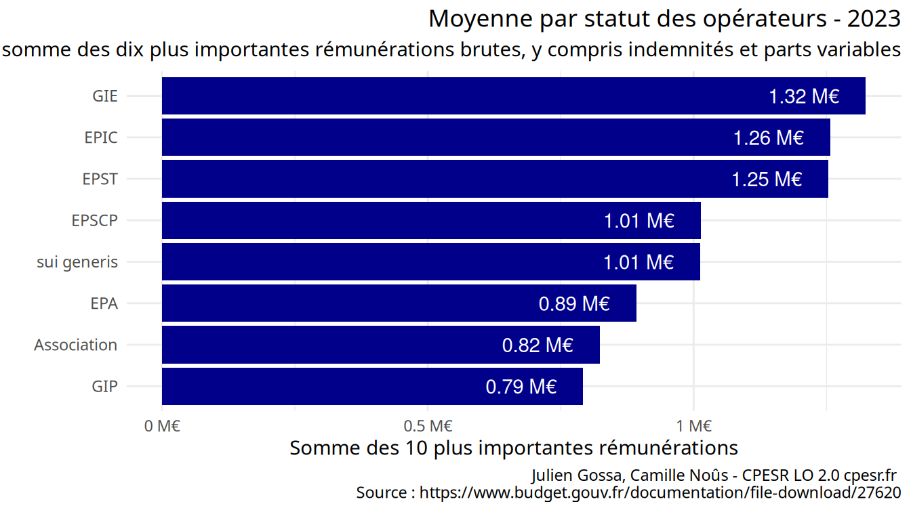

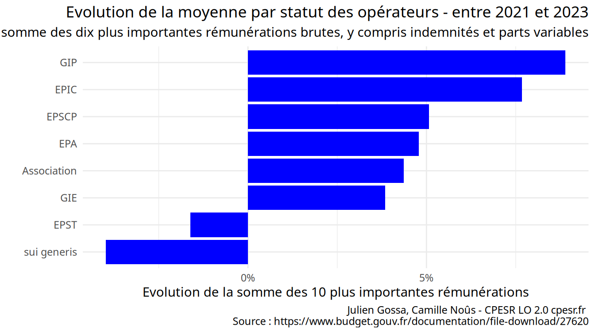

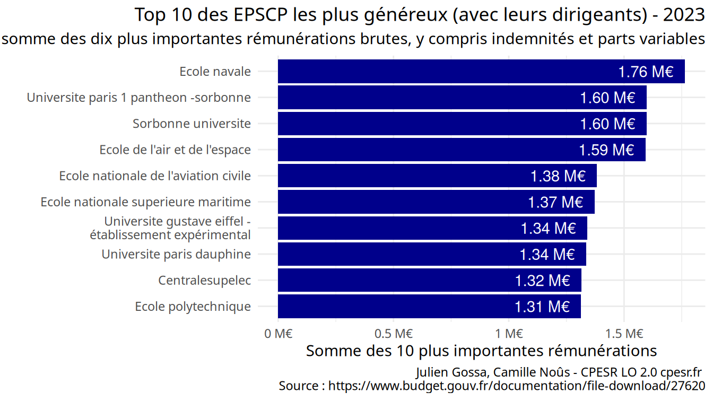

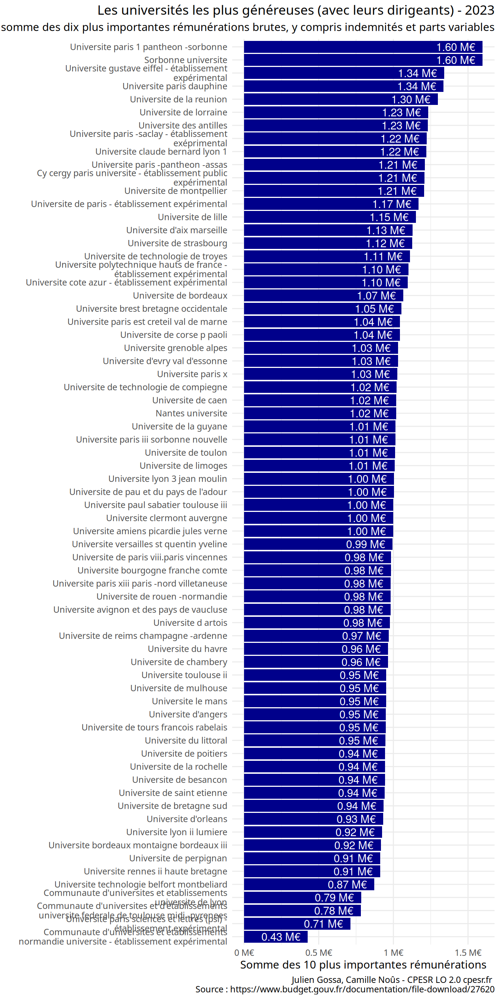

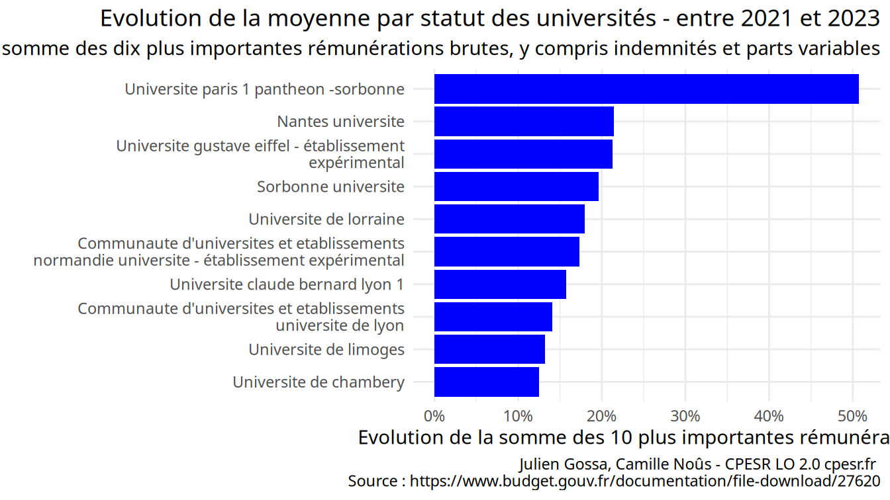
